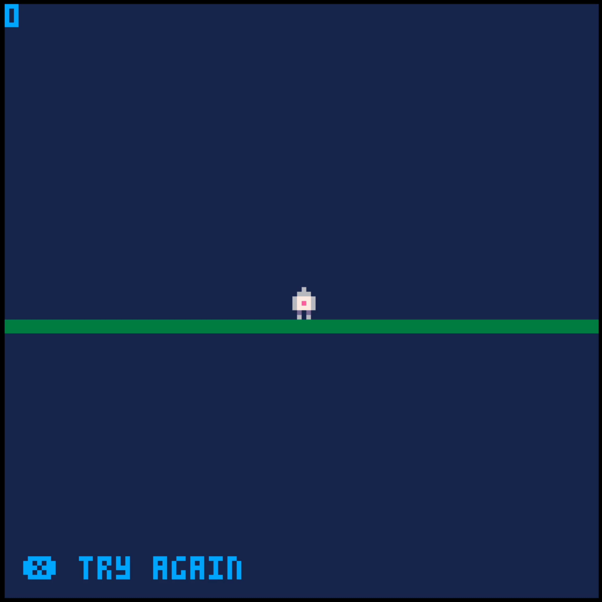

# dance

A very unfinished pico-8 game about dancing.



## Development

Keep this project folder where you keep all your coding projects, then symlink it to the pico-8 carts folder. On a Mac this would be something similar to:

```bash
ln -s $HOME/dev/dance $HOME/Library/Application\ Support/pico-8/carts
```

In the pico-8 terminal you can load the game by running:

```bash
load dance/dance.p8
```

## Deployment

1. Make sure to set a shell variable for `$PICO8_PATH`. On a Mac, something similar to the following can be added to your `.bashrc` or `.zshrc` or whatever shell you use.

    ```bash
    export PICO8_PATH="/Applications/pico-8/PICO-8.app/Contents/MacOS/pico8"
    ```

1. Run `npm run export`.

1. Push to Github.
